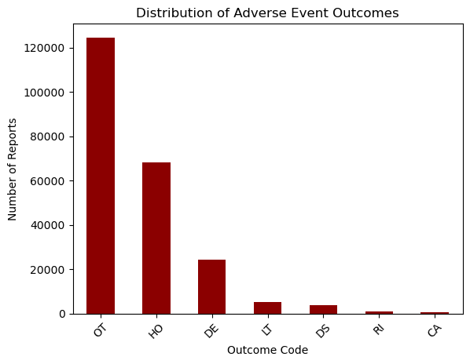

```python
import pandas as pd
import numpy as np


# Define the file path
file_path = "/Users/rahmasemma/Downloads/faers_ascii_2024Q4/ASCII/DRUG24Q4.txt"

# Read the data into a pandas DataFrame
drug_df = pd.read_csv(file_path, sep="$",dtype=str)  # Use dtype=str to handle missing values properly

# Display shape and first few rows
print(drug_df.shape)
print(drug_df)


```

    (2030938, 20)
             primaryid    caseid drug_seq role_cod  \
    0        100100247  10010024        1       PS   
    1        100100247  10010024        2       SS   
    2        100100247  10010024        3       SS   
    3        100100247  10010024        4       SS   
    4        100100247  10010024        5       SS   
    ...            ...       ...      ...      ...   
    2030933   99696784   9969678       12       SS   
    2030934   99696784   9969678       13       SS   
    2030935   99696784   9969678       14        C   
    2030936   99696784   9969678       15        C   
    2030937   99696784   9969678       16        C   
    
                                    drugname                          prod_ai  \
    0                             ADALIMUMAB                       ADALIMUMAB   
    1                             ADALIMUMAB                       ADALIMUMAB   
    2                           CYCLOSPORINE                     CYCLOSPORINE   
    3                               REMICADE                       INFLIXIMAB   
    4                             ETANERCEPT                       ETANERCEPT   
    ...                                  ...                              ...   
    2030933                       DAPTOMYCIN                       DAPTOMYCIN   
    2030934         PANTOPRAZOLE SODIUM I.V.              PANTOPRAZOLE SODIUM   
    2030935  ACETAMINOPHEN\CODEINE PHOSPHATE  ACETAMINOPHEN\CODEINE PHOSPHATE   
    2030936               METHYLPREDNISOLONE               METHYLPREDNISOLONE   
    2030937               METHYLPREDNISOLONE               METHYLPREDNISOLONE   
    
            val_vbm                                  route  \
    0             1                           Subcutaneous   
    1             1                                    NaN   
    2             1                                Unknown   
    3             1  Intravenous (not otherwise specified)   
    4             1                           Subcutaneous   
    ...         ...                                    ...   
    2030933       1                                Unknown   
    2030934       1                                Unknown   
    2030935       1                                Unknown   
    2030936       1                                Unknown   
    2030937       1                                Unknown   
    
                                    dose_vbm cum_dose_chr cum_dose_unit dechal  \
    0                                    NaN          NaN           NaN      Y   
    1                                    NaN          NaN           NaN      Y   
    2                                    NaN          NaN           NaN      D   
    3        6 infusions at 8 weeks interval          NaN           NaN      Y   
    4                                    NaN          NaN           NaN      Y   
    ...                                  ...          ...           ...    ...   
    2030933                    500 mg, Daily          NaN           NaN      Y   
    2030934                       40 mg, UNK          NaN           NaN      U   
    2030935                 500/30 mg, daily          NaN           NaN      Y   
    2030936                       80 mg, bid          NaN           NaN      Y   
    2030937                    12 mg, UNK ()          NaN           NaN      Y   
    
            rechal        lot_num exp_dt nda_num dose_amt dose_unit  dose_form  \
    0          NaN  Not Available    NaN  125057       40        MG        NaN   
    1          NaN            NaN    NaN  125057      NaN       NaN        NaN   
    2          NaN  Not Available    NaN  065003      NaN       NaN        NaN   
    3          NaN  Not Available    NaN     NaN      NaN       NaN        NaN   
    4          NaN  Not Available    NaN     NaN      100        MG        NaN   
    ...        ...            ...    ...     ...      ...       ...        ...   
    2030933    NaN            NaN    NaN     NaN      500        MG        NaN   
    2030934      U            unk    NaN     NaN       40        MG  Injection   
    2030935    NaN            NaN    NaN     NaN      NaN       NaN        NaN   
    2030936    NaN            NaN    NaN     NaN       80        MG        NaN   
    2030937    NaN            NaN    NaN     NaN      NaN       NaN        NaN   
    
            dose_freq  
    0             QOW  
    1             NaN  
    2             NaN  
    3             NaN  
    4             /WK  
    ...           ...  
    2030933       NaN  
    2030934       NaN  
    2030935       NaN  
    2030936      Q12H  
    2030937       NaN  
    
    [2030938 rows x 20 columns]


```python
missing_values = drug_df.isna().mean() * 100

# Display columns with missing percentage
missing_report = pd.DataFrame({'Column': missing_values.index, 'Missing_Percentage': missing_values.values})
missing_report = missing_report.sort_values(by='Missing_Percentage', ascending=False)

# Display the missing values report
print("\nMissing Values Report:\n", missing_report)


```

    
    Missing Values Report:
                Column  Missing_Percentage
    14         exp_dt           99.918363
    10  cum_dose_unit           98.171928
    9    cum_dose_chr           98.171928
    12         rechal           91.248182
    19      dose_freq           79.123587
    13        lot_num           75.371971
    15        nda_num           67.868837
    16       dose_amt           58.707405
    17      dose_unit           58.707405
    18      dose_form           48.967374
    11         dechal           40.503354
    7           route           31.579546
    8        dose_vbm           30.487784
    5         prod_ai            1.478627
    4        drugname            0.000345
    6         val_vbm            0.000000
    1          caseid            0.000000
    3        role_cod            0.000000
    2        drug_seq            0.000000
    0       primaryid            0.000000


```python
# Step 2: Drop Irrelevant Columns (Based on Prior Analysis)
columns_to_drop = ['exp_dt', 'cum_dose_chr', 'cum_dose_unit', 'rechal', 'lot_num', 'nda_num', 'val_vbm']
cleaned_drug_df = drug_df.drop(columns=columns_to_drop)

# Step 3: Save Cleaned Drug Data for Future Use
cleaned_drug_df.to_csv('cleaned_DRUGyyQq.csv', index=False)

# Display Cleaned Data Information
print('Cleaned Drug DataFrame Shape:', cleaned_drug_df.shape)
print('Columns in Cleaned Drug DataFrame:', cleaned_drug_df.columns)
```

    Cleaned Drug DataFrame Shape: (2030938, 13)
    Columns in Cleaned Drug DataFrame: Index(['primaryid', 'caseid', 'drug_seq', 'role_cod', 'drugname', 'prod_ai',
           'route', 'dose_vbm', 'dechal', 'dose_amt', 'dose_unit', 'dose_form',
           'dose_freq'],
          dtype='object')


```python
drug_df[drug_df.primaryid.duplicated()]
```


<div>
<style scoped>
    .dataframe tbody tr th:only-of-type {
        vertical-align: middle;
    }

    .dataframe tbody tr th {
        vertical-align: top;
    }

    .dataframe thead th {
        text-align: right;
    }
</style>
<table border="1" class="dataframe">
  <thead>
    <tr style="text-align: right;">
      <th></th>
      <th>primaryid</th>
      <th>caseid</th>
      <th>drug_seq</th>
      <th>role_cod</th>
      <th>drugname</th>
      <th>prod_ai</th>
      <th>val_vbm</th>
      <th>route</th>
      <th>dose_vbm</th>
      <th>cum_dose_chr</th>
      <th>cum_dose_unit</th>
      <th>dechal</th>
      <th>rechal</th>
      <th>lot_num</th>
      <th>exp_dt</th>
      <th>nda_num</th>
      <th>dose_amt</th>
      <th>dose_unit</th>
      <th>dose_form</th>
      <th>dose_freq</th>
    </tr>
  </thead>
  <tbody>
    <tr>
      <th>1</th>
      <td>100100247</td>
      <td>10010024</td>
      <td>2</td>
      <td>SS</td>
      <td>ADALIMUMAB</td>
      <td>ADALIMUMAB</td>
      <td>1</td>
      <td>NaN</td>
      <td>NaN</td>
      <td>NaN</td>
      <td>NaN</td>
      <td>Y</td>
      <td>NaN</td>
      <td>NaN</td>
      <td>NaN</td>
      <td>125057</td>
      <td>NaN</td>
      <td>NaN</td>
      <td>NaN</td>
      <td>NaN</td>
    </tr>
    <tr>
      <th>2</th>
      <td>100100247</td>
      <td>10010024</td>
      <td>3</td>
      <td>SS</td>
      <td>CYCLOSPORINE</td>
      <td>CYCLOSPORINE</td>
      <td>1</td>
      <td>Unknown</td>
      <td>NaN</td>
      <td>NaN</td>
      <td>NaN</td>
      <td>D</td>
      <td>NaN</td>
      <td>Not Available</td>
      <td>NaN</td>
      <td>065003</td>
      <td>NaN</td>
      <td>NaN</td>
      <td>NaN</td>
      <td>NaN</td>
    </tr>
    <tr>
      <th>3</th>
      <td>100100247</td>
      <td>10010024</td>
      <td>4</td>
      <td>SS</td>
      <td>REMICADE</td>
      <td>INFLIXIMAB</td>
      <td>1</td>
      <td>Intravenous (not otherwise specified)</td>
      <td>6 infusions at 8 weeks interval</td>
      <td>NaN</td>
      <td>NaN</td>
      <td>Y</td>
      <td>NaN</td>
      <td>Not Available</td>
      <td>NaN</td>
      <td>NaN</td>
      <td>NaN</td>
      <td>NaN</td>
      <td>NaN</td>
      <td>NaN</td>
    </tr>
    <tr>
      <th>4</th>
      <td>100100247</td>
      <td>10010024</td>
      <td>5</td>
      <td>SS</td>
      <td>ETANERCEPT</td>
      <td>ETANERCEPT</td>
      <td>1</td>
      <td>Subcutaneous</td>
      <td>NaN</td>
      <td>NaN</td>
      <td>NaN</td>
      <td>Y</td>
      <td>NaN</td>
      <td>Not Available</td>
      <td>NaN</td>
      <td>NaN</td>
      <td>100</td>
      <td>MG</td>
      <td>NaN</td>
      <td>/WK</td>
    </tr>
    <tr>
      <th>5</th>
      <td>100100247</td>
      <td>10010024</td>
      <td>6</td>
      <td>SS</td>
      <td>METHOTREXATE</td>
      <td>METHOTREXATE</td>
      <td>1</td>
      <td>Unknown</td>
      <td>NaN</td>
      <td>NaN</td>
      <td>NaN</td>
      <td>Y</td>
      <td>NaN</td>
      <td>Not Available</td>
      <td>NaN</td>
      <td>NaN</td>
      <td>NaN</td>
      <td>NaN</td>
      <td>NaN</td>
      <td>NaN</td>
    </tr>
    <tr>
      <th>...</th>
      <td>...</td>
      <td>...</td>
      <td>...</td>
      <td>...</td>
      <td>...</td>
      <td>...</td>
      <td>...</td>
      <td>...</td>
      <td>...</td>
      <td>...</td>
      <td>...</td>
      <td>...</td>
      <td>...</td>
      <td>...</td>
      <td>...</td>
      <td>...</td>
      <td>...</td>
      <td>...</td>
      <td>...</td>
      <td>...</td>
    </tr>
    <tr>
      <th>2030933</th>
      <td>99696784</td>
      <td>9969678</td>
      <td>12</td>
      <td>SS</td>
      <td>DAPTOMYCIN</td>
      <td>DAPTOMYCIN</td>
      <td>1</td>
      <td>Unknown</td>
      <td>500 mg, Daily</td>
      <td>NaN</td>
      <td>NaN</td>
      <td>Y</td>
      <td>NaN</td>
      <td>NaN</td>
      <td>NaN</td>
      <td>NaN</td>
      <td>500</td>
      <td>MG</td>
      <td>NaN</td>
      <td>NaN</td>
    </tr>
    <tr>
      <th>2030934</th>
      <td>99696784</td>
      <td>9969678</td>
      <td>13</td>
      <td>SS</td>
      <td>PANTOPRAZOLE SODIUM I.V.</td>
      <td>PANTOPRAZOLE SODIUM</td>
      <td>1</td>
      <td>Unknown</td>
      <td>40 mg, UNK</td>
      <td>NaN</td>
      <td>NaN</td>
      <td>U</td>
      <td>U</td>
      <td>unk</td>
      <td>NaN</td>
      <td>NaN</td>
      <td>40</td>
      <td>MG</td>
      <td>Injection</td>
      <td>NaN</td>
    </tr>
    <tr>
      <th>2030935</th>
      <td>99696784</td>
      <td>9969678</td>
      <td>14</td>
      <td>C</td>
      <td>ACETAMINOPHEN\CODEINE PHOSPHATE</td>
      <td>ACETAMINOPHEN\CODEINE PHOSPHATE</td>
      <td>1</td>
      <td>Unknown</td>
      <td>500/30 mg, daily</td>
      <td>NaN</td>
      <td>NaN</td>
      <td>Y</td>
      <td>NaN</td>
      <td>NaN</td>
      <td>NaN</td>
      <td>NaN</td>
      <td>NaN</td>
      <td>NaN</td>
      <td>NaN</td>
      <td>NaN</td>
    </tr>
    <tr>
      <th>2030936</th>
      <td>99696784</td>
      <td>9969678</td>
      <td>15</td>
      <td>C</td>
      <td>METHYLPREDNISOLONE</td>
      <td>METHYLPREDNISOLONE</td>
      <td>1</td>
      <td>Unknown</td>
      <td>80 mg, bid</td>
      <td>NaN</td>
      <td>NaN</td>
      <td>Y</td>
      <td>NaN</td>
      <td>NaN</td>
      <td>NaN</td>
      <td>NaN</td>
      <td>80</td>
      <td>MG</td>
      <td>NaN</td>
      <td>Q12H</td>
    </tr>
    <tr>
      <th>2030937</th>
      <td>99696784</td>
      <td>9969678</td>
      <td>16</td>
      <td>C</td>
      <td>METHYLPREDNISOLONE</td>
      <td>METHYLPREDNISOLONE</td>
      <td>1</td>
      <td>Unknown</td>
      <td>12 mg, UNK ()</td>
      <td>NaN</td>
      <td>NaN</td>
      <td>Y</td>
      <td>NaN</td>
      <td>NaN</td>
      <td>NaN</td>
      <td>NaN</td>
      <td>NaN</td>
      <td>NaN</td>
      <td>NaN</td>
      <td>NaN</td>
    </tr>
  </tbody>
</table>
<p>1620089 rows × 20 columns</p>
</div>


```python
# Finding unique rows based on 'PRIMARYID'
unique_drug_df = cleaned_drug_df.drop_duplicates(subset='primaryid')

# Checking the number of unique rows
print(f"Number of Unique Rows: {unique_drug_df.shape[0]}")

# Optionally, save this unique data to a file
unique_drug_df.to_csv('unique_cleaned_DRUGyyQq.csv', index=False)
unique_drug_df
```

    Number of Unique Rows: 410849


<div>
<style scoped>
    .dataframe tbody tr th:only-of-type {
        vertical-align: middle;
    }

    .dataframe tbody tr th {
        vertical-align: top;
    }

    .dataframe thead th {
        text-align: right;
    }
</style>
<table border="1" class="dataframe">
  <thead>
    <tr style="text-align: right;">
      <th></th>
      <th>primaryid</th>
      <th>caseid</th>
      <th>drug_seq</th>
      <th>role_cod</th>
      <th>drugname</th>
      <th>prod_ai</th>
      <th>route</th>
      <th>dose_vbm</th>
      <th>dechal</th>
      <th>dose_amt</th>
      <th>dose_unit</th>
      <th>dose_form</th>
      <th>dose_freq</th>
    </tr>
  </thead>
  <tbody>
    <tr>
      <th>0</th>
      <td>100100247</td>
      <td>10010024</td>
      <td>1</td>
      <td>PS</td>
      <td>ADALIMUMAB</td>
      <td>ADALIMUMAB</td>
      <td>Subcutaneous</td>
      <td>NaN</td>
      <td>Y</td>
      <td>40</td>
      <td>MG</td>
      <td>NaN</td>
      <td>QOW</td>
    </tr>
    <tr>
      <th>10</th>
      <td>100373859</td>
      <td>10037385</td>
      <td>1</td>
      <td>PS</td>
      <td>ANASTROZOLE</td>
      <td>ANASTROZOLE</td>
      <td>Oral</td>
      <td>Anastazole pack NO:1040431625896</td>
      <td>Y</td>
      <td>1</td>
      <td>MG</td>
      <td>Tablet</td>
      <td>QD</td>
    </tr>
    <tr>
      <th>18</th>
      <td>1016611044</td>
      <td>10166110</td>
      <td>1</td>
      <td>PS</td>
      <td>XOLAIR</td>
      <td>OMALIZUMAB</td>
      <td>Subcutaneous</td>
      <td>NaN</td>
      <td>U</td>
      <td>375</td>
      <td>MG</td>
      <td>INJECTION, SOLUTION</td>
      <td>QOW</td>
    </tr>
    <tr>
      <th>52</th>
      <td>101735213</td>
      <td>10173521</td>
      <td>1</td>
      <td>PS</td>
      <td>REMICADE</td>
      <td>INFLIXIMAB</td>
      <td>Intravenous drip</td>
      <td>NaN</td>
      <td>NaN</td>
      <td>NaN</td>
      <td>NaN</td>
      <td>Solution for infusion</td>
      <td>NaN</td>
    </tr>
    <tr>
      <th>55</th>
      <td>1020101730</td>
      <td>10201017</td>
      <td>1</td>
      <td>PS</td>
      <td>SANDOSTATIN LAR DEPOT</td>
      <td>OCTREOTIDE ACETATE</td>
      <td>Intramuscular</td>
      <td>30 mg, Q4W (every 4 weeks)</td>
      <td>Y</td>
      <td>30</td>
      <td>MG</td>
      <td>NaN</td>
      <td>/MONTH</td>
    </tr>
    <tr>
      <th>...</th>
      <td>...</td>
      <td>...</td>
      <td>...</td>
      <td>...</td>
      <td>...</td>
      <td>...</td>
      <td>...</td>
      <td>...</td>
      <td>...</td>
      <td>...</td>
      <td>...</td>
      <td>...</td>
      <td>...</td>
    </tr>
    <tr>
      <th>2030907</th>
      <td>99198746</td>
      <td>9919874</td>
      <td>1</td>
      <td>PS</td>
      <td>GILENYA</td>
      <td>FINGOLIMOD HYDROCHLORIDE</td>
      <td>Oral</td>
      <td>0.5 mg, QD</td>
      <td>Y</td>
      <td>0.5</td>
      <td>MG</td>
      <td>NaN</td>
      <td>QD</td>
    </tr>
    <tr>
      <th>2030911</th>
      <td>99310683</td>
      <td>9931068</td>
      <td>1</td>
      <td>PS</td>
      <td>CYCLOSPORINE</td>
      <td>CYCLOSPORINE</td>
      <td>Oral</td>
      <td>UNK</td>
      <td>D</td>
      <td>NaN</td>
      <td>NaN</td>
      <td>NaN</td>
      <td>NaN</td>
    </tr>
    <tr>
      <th>2030915</th>
      <td>99310703</td>
      <td>9931070</td>
      <td>1</td>
      <td>PS</td>
      <td>CYCLOSPORINE</td>
      <td>CYCLOSPORINE</td>
      <td>Unknown</td>
      <td>UNK</td>
      <td>NaN</td>
      <td>NaN</td>
      <td>NaN</td>
      <td>NaN</td>
      <td>NaN</td>
    </tr>
    <tr>
      <th>2030919</th>
      <td>99310743</td>
      <td>9931074</td>
      <td>1</td>
      <td>PS</td>
      <td>CYCLOSPORINE</td>
      <td>CYCLOSPORINE</td>
      <td>Oral</td>
      <td>UNK</td>
      <td>D</td>
      <td>NaN</td>
      <td>NaN</td>
      <td>NaN</td>
      <td>NaN</td>
    </tr>
    <tr>
      <th>2030922</th>
      <td>99696784</td>
      <td>9969678</td>
      <td>1</td>
      <td>SS</td>
      <td>CEFUROXIME</td>
      <td>CEFUROXIME</td>
      <td>Unknown</td>
      <td>1.5 g, tid</td>
      <td>Y</td>
      <td>1.5</td>
      <td>GM</td>
      <td>NaN</td>
      <td>Q8H</td>
    </tr>
  </tbody>
</table>
<p>410849 rows × 13 columns</p>
</div>


```python
# Define the file path
file_path = "/Users/rahmasemma/Downloads/faers_ascii_2024Q4/ASCII/REAC24Q4.txt"

# Read the data into a pandas DataFrame
reac_df = pd.read_csv(file_path, sep="$",dtype=str)  # Use dtype=str to handle missing values properly

# Display shape and first few rows
print(reac_df.shape)
reac_df
```

    (1472750, 4)


<div>
<style scoped>
    .dataframe tbody tr th:only-of-type {
        vertical-align: middle;
    }

    .dataframe tbody tr th {
        vertical-align: top;
    }

    .dataframe thead th {
        text-align: right;
    }
</style>
<table border="1" class="dataframe">
  <thead>
    <tr style="text-align: right;">
      <th></th>
      <th>primaryid</th>
      <th>caseid</th>
      <th>pt</th>
      <th>drug_rec_act</th>
    </tr>
  </thead>
  <tbody>
    <tr>
      <th>0</th>
      <td>100100247</td>
      <td>10010024</td>
      <td>Malignant melanoma stage I</td>
      <td>NaN</td>
    </tr>
    <tr>
      <th>1</th>
      <td>100100247</td>
      <td>10010024</td>
      <td>Keratoacanthoma</td>
      <td>NaN</td>
    </tr>
    <tr>
      <th>2</th>
      <td>100100247</td>
      <td>10010024</td>
      <td>Blood pressure increased</td>
      <td>NaN</td>
    </tr>
    <tr>
      <th>3</th>
      <td>100100247</td>
      <td>10010024</td>
      <td>Keratoacanthoma</td>
      <td>NaN</td>
    </tr>
    <tr>
      <th>4</th>
      <td>100100247</td>
      <td>10010024</td>
      <td>Hyperkeratosis</td>
      <td>NaN</td>
    </tr>
    <tr>
      <th>...</th>
      <td>...</td>
      <td>...</td>
      <td>...</td>
      <td>...</td>
    </tr>
    <tr>
      <th>1472745</th>
      <td>99310703</td>
      <td>9931070</td>
      <td>Liver transplant rejection</td>
      <td>NaN</td>
    </tr>
    <tr>
      <th>1472746</th>
      <td>99310703</td>
      <td>9931070</td>
      <td>Post transplant lymphoproliferative disorder</td>
      <td>NaN</td>
    </tr>
    <tr>
      <th>1472747</th>
      <td>99310743</td>
      <td>9931074</td>
      <td>Post transplant lymphoproliferative disorder</td>
      <td>NaN</td>
    </tr>
    <tr>
      <th>1472748</th>
      <td>99696784</td>
      <td>9969678</td>
      <td>Drug reaction with eosinophilia and systemic s...</td>
      <td>NaN</td>
    </tr>
    <tr>
      <th>1472749</th>
      <td>99696784</td>
      <td>9969678</td>
      <td>Toxic epidermal necrolysis</td>
      <td>NaN</td>
    </tr>
  </tbody>
</table>
<p>1472750 rows × 4 columns</p>
</div>


```python
missing_values = reac_df.isna().mean() * 100

# Display columns with missing percentage
missing_report = pd.DataFrame({'Column': missing_values.index, 'Missing_Percentage': missing_values.values})
missing_report = missing_report.sort_values(by='Missing_Percentage', ascending=False)

# Display the missing values report
print("\nMissing Values Report:\n", missing_report)

```

    
    Missing Values Report:
              Column  Missing_Percentage
    3  drug_rec_act           99.915464
    0     primaryid            0.000000
    1        caseid            0.000000
    2            pt            0.000000


```python
# Step 2: Drop Irrelevant Columns (Based on Prior Analysis)
columns_to_drop = ['drug_rec_act']
cleaned_reac_df = reac_df.drop(columns=columns_to_drop)

# Step 3: Save Cleaned Drug Data for Future Use
cleaned_reac_df.to_csv('cleaned_reacQq.csv', index=False)

# Display Cleaned Data Information
print('Cleaned reac DataFrame Shape:', cleaned_drug_df.shape)
print('Columns in Cleaned reac DataFrame:', cleaned_drug_df.columns)
cleaned_reac_df
```

    Cleaned reac DataFrame Shape: (2030938, 13)
    Columns in Cleaned reac DataFrame: Index(['primaryid', 'caseid', 'drug_seq', 'role_cod', 'drugname', 'prod_ai',
           'route', 'dose_vbm', 'dechal', 'dose_amt', 'dose_unit', 'dose_form',
           'dose_freq'],
          dtype='object')


<div>
<style scoped>
    .dataframe tbody tr th:only-of-type {
        vertical-align: middle;
    }

    .dataframe tbody tr th {
        vertical-align: top;
    }

    .dataframe thead th {
        text-align: right;
    }
</style>
<table border="1" class="dataframe">
  <thead>
    <tr style="text-align: right;">
      <th></th>
      <th>primaryid</th>
      <th>caseid</th>
      <th>pt</th>
    </tr>
  </thead>
  <tbody>
    <tr>
      <th>0</th>
      <td>100100247</td>
      <td>10010024</td>
      <td>Malignant melanoma stage I</td>
    </tr>
    <tr>
      <th>1</th>
      <td>100100247</td>
      <td>10010024</td>
      <td>Keratoacanthoma</td>
    </tr>
    <tr>
      <th>2</th>
      <td>100100247</td>
      <td>10010024</td>
      <td>Blood pressure increased</td>
    </tr>
    <tr>
      <th>3</th>
      <td>100100247</td>
      <td>10010024</td>
      <td>Keratoacanthoma</td>
    </tr>
    <tr>
      <th>4</th>
      <td>100100247</td>
      <td>10010024</td>
      <td>Hyperkeratosis</td>
    </tr>
    <tr>
      <th>...</th>
      <td>...</td>
      <td>...</td>
      <td>...</td>
    </tr>
    <tr>
      <th>1472745</th>
      <td>99310703</td>
      <td>9931070</td>
      <td>Liver transplant rejection</td>
    </tr>
    <tr>
      <th>1472746</th>
      <td>99310703</td>
      <td>9931070</td>
      <td>Post transplant lymphoproliferative disorder</td>
    </tr>
    <tr>
      <th>1472747</th>
      <td>99310743</td>
      <td>9931074</td>
      <td>Post transplant lymphoproliferative disorder</td>
    </tr>
    <tr>
      <th>1472748</th>
      <td>99696784</td>
      <td>9969678</td>
      <td>Drug reaction with eosinophilia and systemic s...</td>
    </tr>
    <tr>
      <th>1472749</th>
      <td>99696784</td>
      <td>9969678</td>
      <td>Toxic epidermal necrolysis</td>
    </tr>
  </tbody>
</table>
<p>1472750 rows × 3 columns</p>
</div>


```python
# Finding unique rows based on 'PRIMARYID'
unique_reac_df = cleaned_reac_df.drop_duplicates(subset='primaryid')

# Checking the number of unique rows
print(f"Number of Unique Rows: {unique_reac_df.shape[0]}")

# Optionally, save this unique data to a file
unique_reac_df.to_csv('unique_cleaned_reacQq.csv', index=False)
unique_reac_df
```

    Number of Unique Rows: 410849


<div>
<style scoped>
    .dataframe tbody tr th:only-of-type {
        vertical-align: middle;
    }

    .dataframe tbody tr th {
        vertical-align: top;
    }

    .dataframe thead th {
        text-align: right;
    }
</style>
<table border="1" class="dataframe">
  <thead>
    <tr style="text-align: right;">
      <th></th>
      <th>primaryid</th>
      <th>caseid</th>
      <th>pt</th>
    </tr>
  </thead>
  <tbody>
    <tr>
      <th>0</th>
      <td>100100247</td>
      <td>10010024</td>
      <td>Malignant melanoma stage I</td>
    </tr>
    <tr>
      <th>6</th>
      <td>100373859</td>
      <td>10037385</td>
      <td>Magnesium deficiency</td>
    </tr>
    <tr>
      <th>71</th>
      <td>1016611044</td>
      <td>10166110</td>
      <td>Headache</td>
    </tr>
    <tr>
      <th>99</th>
      <td>101735213</td>
      <td>10173521</td>
      <td>Gastrointestinal inflammation</td>
    </tr>
    <tr>
      <th>100</th>
      <td>1020101730</td>
      <td>10201017</td>
      <td>Wrong technique in product usage process</td>
    </tr>
    <tr>
      <th>...</th>
      <td>...</td>
      <td>...</td>
      <td>...</td>
    </tr>
    <tr>
      <th>1472739</th>
      <td>99198746</td>
      <td>9919874</td>
      <td>Alanine aminotransferase increased</td>
    </tr>
    <tr>
      <th>1472743</th>
      <td>99310683</td>
      <td>9931068</td>
      <td>Kidney transplant rejection</td>
    </tr>
    <tr>
      <th>1472745</th>
      <td>99310703</td>
      <td>9931070</td>
      <td>Liver transplant rejection</td>
    </tr>
    <tr>
      <th>1472747</th>
      <td>99310743</td>
      <td>9931074</td>
      <td>Post transplant lymphoproliferative disorder</td>
    </tr>
    <tr>
      <th>1472748</th>
      <td>99696784</td>
      <td>9969678</td>
      <td>Drug reaction with eosinophilia and systemic s...</td>
    </tr>
  </tbody>
</table>
<p>410849 rows × 3 columns</p>
</div>


```python
# Define the file path
file_path = "/Users/rahmasemma/Downloads/faers_ascii_2024Q4/ASCII/OUTC24Q4.txt"

# Read the data into a pandas DataFrame
OUTC_df = pd.read_csv(file_path, sep="$",dtype=str)  # Use dtype=str to handle missing values properly

# Display shape and first few rows
print(OUTC_df.shape)
OUTC_df
```

    (308960, 3)


<div>
<style scoped>
    .dataframe tbody tr th:only-of-type {
        vertical-align: middle;
    }

    .dataframe tbody tr th {
        vertical-align: top;
    }

    .dataframe thead th {
        text-align: right;
    }
</style>
<table border="1" class="dataframe">
  <thead>
    <tr style="text-align: right;">
      <th></th>
      <th>primaryid</th>
      <th>caseid</th>
      <th>outc_cod</th>
    </tr>
  </thead>
  <tbody>
    <tr>
      <th>0</th>
      <td>100100247</td>
      <td>10010024</td>
      <td>OT</td>
    </tr>
    <tr>
      <th>1</th>
      <td>100373859</td>
      <td>10037385</td>
      <td>DS</td>
    </tr>
    <tr>
      <th>2</th>
      <td>100373859</td>
      <td>10037385</td>
      <td>OT</td>
    </tr>
    <tr>
      <th>3</th>
      <td>1016611044</td>
      <td>10166110</td>
      <td>HO</td>
    </tr>
    <tr>
      <th>4</th>
      <td>1016611044</td>
      <td>10166110</td>
      <td>OT</td>
    </tr>
    <tr>
      <th>...</th>
      <td>...</td>
      <td>...</td>
      <td>...</td>
    </tr>
    <tr>
      <th>308955</th>
      <td>99310683</td>
      <td>9931068</td>
      <td>OT</td>
    </tr>
    <tr>
      <th>308956</th>
      <td>99310703</td>
      <td>9931070</td>
      <td>DE</td>
    </tr>
    <tr>
      <th>308957</th>
      <td>99310703</td>
      <td>9931070</td>
      <td>OT</td>
    </tr>
    <tr>
      <th>308958</th>
      <td>99310743</td>
      <td>9931074</td>
      <td>DE</td>
    </tr>
    <tr>
      <th>308959</th>
      <td>99696784</td>
      <td>9969678</td>
      <td>OT</td>
    </tr>
  </tbody>
</table>
<p>308960 rows × 3 columns</p>
</div>


```python
missing_values = OUTC_df.isna().mean() * 100

# Display columns with missing percentage
missing_report = pd.DataFrame({'Column': missing_values.index, 'Missing_Percentage': missing_values.values})
missing_report = missing_report.sort_values(by='Missing_Percentage', ascending=False)

# Display the missing values report
print("\nMissing Values Report:\n", missing_report)

```

    
    Missing Values Report:
           Column  Missing_Percentage
    0  primaryid                 0.0
    1     caseid                 0.0
    2   outc_cod                 0.0


```python
# Finding unique rows based on 'PRIMARYID'
unique_OUTC_df = OUTC_df.drop_duplicates(subset='primaryid')

# Checking the number of unique rows
print(f"Number of Unique Rows: {unique_OUTC_df.shape[0]}")

# Optionally, save this unique data to a file
unique_OUTC_df.to_csv('unique_reac_df.csv', index=False)
unique_OUTC_df
```

    Number of Unique Rows: 227854


<div>
<style scoped>
    .dataframe tbody tr th:only-of-type {
        vertical-align: middle;
    }

    .dataframe tbody tr th {
        vertical-align: top;
    }

    .dataframe thead th {
        text-align: right;
    }
</style>
<table border="1" class="dataframe">
  <thead>
    <tr style="text-align: right;">
      <th></th>
      <th>primaryid</th>
      <th>caseid</th>
      <th>outc_cod</th>
    </tr>
  </thead>
  <tbody>
    <tr>
      <th>0</th>
      <td>100100247</td>
      <td>10010024</td>
      <td>OT</td>
    </tr>
    <tr>
      <th>1</th>
      <td>100373859</td>
      <td>10037385</td>
      <td>DS</td>
    </tr>
    <tr>
      <th>3</th>
      <td>1016611044</td>
      <td>10166110</td>
      <td>HO</td>
    </tr>
    <tr>
      <th>5</th>
      <td>101735213</td>
      <td>10173521</td>
      <td>HO</td>
    </tr>
    <tr>
      <th>6</th>
      <td>1020101730</td>
      <td>10201017</td>
      <td>HO</td>
    </tr>
    <tr>
      <th>...</th>
      <td>...</td>
      <td>...</td>
      <td>...</td>
    </tr>
    <tr>
      <th>308953</th>
      <td>99198746</td>
      <td>9919874</td>
      <td>OT</td>
    </tr>
    <tr>
      <th>308954</th>
      <td>99310683</td>
      <td>9931068</td>
      <td>DE</td>
    </tr>
    <tr>
      <th>308956</th>
      <td>99310703</td>
      <td>9931070</td>
      <td>DE</td>
    </tr>
    <tr>
      <th>308958</th>
      <td>99310743</td>
      <td>9931074</td>
      <td>DE</td>
    </tr>
    <tr>
      <th>308959</th>
      <td>99696784</td>
      <td>9969678</td>
      <td>OT</td>
    </tr>
  </tbody>
</table>
<p>227854 rows × 3 columns</p>
</div>


```python
# Merge 1: Reaction + Demo
merged_df_1 = pd.merge(unique_reac_df, unique_drug_df, on='primaryid', how='inner')

# Merge 2: Add Drug data
final_merged_df = pd.merge(merged_df_1, unique_OUTC_df, on='primaryid', how='inner')

# Save to CSV
final_merged_df.to_csv('merged_unique_data.csv', index=False)

# Optional: display the final merged DataFrame
final_merged_df

```


<div>
<style scoped>
    .dataframe tbody tr th:only-of-type {
        vertical-align: middle;
    }

    .dataframe tbody tr th {
        vertical-align: top;
    }

    .dataframe thead th {
        text-align: right;
    }
</style>
<table border="1" class="dataframe">
  <thead>
    <tr style="text-align: right;">
      <th></th>
      <th>primaryid</th>
      <th>caseid_x</th>
      <th>pt</th>
      <th>caseid_y</th>
      <th>drug_seq</th>
      <th>role_cod</th>
      <th>drugname</th>
      <th>prod_ai</th>
      <th>route</th>
      <th>dose_vbm</th>
      <th>dechal</th>
      <th>dose_amt</th>
      <th>dose_unit</th>
      <th>dose_form</th>
      <th>dose_freq</th>
      <th>caseid</th>
      <th>outc_cod</th>
    </tr>
  </thead>
  <tbody>
    <tr>
      <th>0</th>
      <td>100100247</td>
      <td>10010024</td>
      <td>Malignant melanoma stage I</td>
      <td>10010024</td>
      <td>1</td>
      <td>PS</td>
      <td>ADALIMUMAB</td>
      <td>ADALIMUMAB</td>
      <td>Subcutaneous</td>
      <td>NaN</td>
      <td>Y</td>
      <td>40</td>
      <td>MG</td>
      <td>NaN</td>
      <td>QOW</td>
      <td>10010024</td>
      <td>OT</td>
    </tr>
    <tr>
      <th>1</th>
      <td>100373859</td>
      <td>10037385</td>
      <td>Magnesium deficiency</td>
      <td>10037385</td>
      <td>1</td>
      <td>PS</td>
      <td>ANASTROZOLE</td>
      <td>ANASTROZOLE</td>
      <td>Oral</td>
      <td>Anastazole pack NO:1040431625896</td>
      <td>Y</td>
      <td>1</td>
      <td>MG</td>
      <td>Tablet</td>
      <td>QD</td>
      <td>10037385</td>
      <td>DS</td>
    </tr>
    <tr>
      <th>2</th>
      <td>1016611044</td>
      <td>10166110</td>
      <td>Headache</td>
      <td>10166110</td>
      <td>1</td>
      <td>PS</td>
      <td>XOLAIR</td>
      <td>OMALIZUMAB</td>
      <td>Subcutaneous</td>
      <td>NaN</td>
      <td>U</td>
      <td>375</td>
      <td>MG</td>
      <td>INJECTION, SOLUTION</td>
      <td>QOW</td>
      <td>10166110</td>
      <td>HO</td>
    </tr>
    <tr>
      <th>3</th>
      <td>101735213</td>
      <td>10173521</td>
      <td>Gastrointestinal inflammation</td>
      <td>10173521</td>
      <td>1</td>
      <td>PS</td>
      <td>REMICADE</td>
      <td>INFLIXIMAB</td>
      <td>Intravenous drip</td>
      <td>NaN</td>
      <td>NaN</td>
      <td>NaN</td>
      <td>NaN</td>
      <td>Solution for infusion</td>
      <td>NaN</td>
      <td>10173521</td>
      <td>HO</td>
    </tr>
    <tr>
      <th>4</th>
      <td>1020101730</td>
      <td>10201017</td>
      <td>Wrong technique in product usage process</td>
      <td>10201017</td>
      <td>1</td>
      <td>PS</td>
      <td>SANDOSTATIN LAR DEPOT</td>
      <td>OCTREOTIDE ACETATE</td>
      <td>Intramuscular</td>
      <td>30 mg, Q4W (every 4 weeks)</td>
      <td>Y</td>
      <td>30</td>
      <td>MG</td>
      <td>NaN</td>
      <td>/MONTH</td>
      <td>10201017</td>
      <td>HO</td>
    </tr>
    <tr>
      <th>...</th>
      <td>...</td>
      <td>...</td>
      <td>...</td>
      <td>...</td>
      <td>...</td>
      <td>...</td>
      <td>...</td>
      <td>...</td>
      <td>...</td>
      <td>...</td>
      <td>...</td>
      <td>...</td>
      <td>...</td>
      <td>...</td>
      <td>...</td>
      <td>...</td>
      <td>...</td>
    </tr>
    <tr>
      <th>227849</th>
      <td>99198746</td>
      <td>9919874</td>
      <td>Alanine aminotransferase increased</td>
      <td>9919874</td>
      <td>1</td>
      <td>PS</td>
      <td>GILENYA</td>
      <td>FINGOLIMOD HYDROCHLORIDE</td>
      <td>Oral</td>
      <td>0.5 mg, QD</td>
      <td>Y</td>
      <td>0.5</td>
      <td>MG</td>
      <td>NaN</td>
      <td>QD</td>
      <td>9919874</td>
      <td>OT</td>
    </tr>
    <tr>
      <th>227850</th>
      <td>99310683</td>
      <td>9931068</td>
      <td>Kidney transplant rejection</td>
      <td>9931068</td>
      <td>1</td>
      <td>PS</td>
      <td>CYCLOSPORINE</td>
      <td>CYCLOSPORINE</td>
      <td>Oral</td>
      <td>UNK</td>
      <td>D</td>
      <td>NaN</td>
      <td>NaN</td>
      <td>NaN</td>
      <td>NaN</td>
      <td>9931068</td>
      <td>DE</td>
    </tr>
    <tr>
      <th>227851</th>
      <td>99310703</td>
      <td>9931070</td>
      <td>Liver transplant rejection</td>
      <td>9931070</td>
      <td>1</td>
      <td>PS</td>
      <td>CYCLOSPORINE</td>
      <td>CYCLOSPORINE</td>
      <td>Unknown</td>
      <td>UNK</td>
      <td>NaN</td>
      <td>NaN</td>
      <td>NaN</td>
      <td>NaN</td>
      <td>NaN</td>
      <td>9931070</td>
      <td>DE</td>
    </tr>
    <tr>
      <th>227852</th>
      <td>99310743</td>
      <td>9931074</td>
      <td>Post transplant lymphoproliferative disorder</td>
      <td>9931074</td>
      <td>1</td>
      <td>PS</td>
      <td>CYCLOSPORINE</td>
      <td>CYCLOSPORINE</td>
      <td>Oral</td>
      <td>UNK</td>
      <td>D</td>
      <td>NaN</td>
      <td>NaN</td>
      <td>NaN</td>
      <td>NaN</td>
      <td>9931074</td>
      <td>DE</td>
    </tr>
    <tr>
      <th>227853</th>
      <td>99696784</td>
      <td>9969678</td>
      <td>Drug reaction with eosinophilia and systemic s...</td>
      <td>9969678</td>
      <td>1</td>
      <td>SS</td>
      <td>CEFUROXIME</td>
      <td>CEFUROXIME</td>
      <td>Unknown</td>
      <td>1.5 g, tid</td>
      <td>Y</td>
      <td>1.5</td>
      <td>GM</td>
      <td>NaN</td>
      <td>Q8H</td>
      <td>9969678</td>
      <td>OT</td>
    </tr>
  </tbody>
</table>
<p>227854 rows × 17 columns</p>
</div>


```python
final_merged_df.drugname.value_counts()
```


    VEDOLIZUMAB         5186
    SKYRIZI             3738
    RINVOQ              3113
    DUPIXENT            3011
    INFLECTRA           2643
                        ... 
    FLURAZEPAM             1
    AMPHETAMINES NOS       1
    RUCAPARIB              1
    SALBUHEXAL             1
    TIPRANAVIR             1
    Name: drugname, Length: 4227, dtype: int64


```python
import matplotlib.pyplot as plt

# Get top 20 drugs
top_drugs = final_merged_df['drugname'].value_counts().head(20)

# Plot bar chart
plt.figure(figsize=(12, 6))
top_drugs.plot(kind='bar', color='darkred')
plt.title('Top 20 Most Reported Drugs')
plt.xlabel('Drug Name')
plt.ylabel('Number of Reports')
plt.xticks(rotation=45, ha='right')
plt.tight_layout()
plt.show()
```


    

    


```python
len(drug_df.drugname.unique())
```


    27176


```python
final_merged_df2 = pd.merge(merged_df_1, unique_OUTC_df, on='primaryid', how='inner')
final_merged_df2.to_csv('merged_unique_data.csv', index=False)
# Force conversion again, coerce non-numeric values to NaN
final_merged_df2['dose_amt'] = pd.to_numeric(final_merged_df2['dose_amt'], errors='coerce')

# Check if conversion worked
final_merged_df2['dose_amt'].dtype
```


    dtype('float64')


```python
final_merged_df2.to_csv('merged_unique_data.csv', index=False)
# Force conversion again, coerce non-numeric values to NaN

final_merged_df2['drugname'] = final_merged_df2['drugname'].to_string()
#df['dose_amt'] = df['dose_amt'].astype(str)

# Check if conversion worked
final_merged_df2['drugname'].dtype
#print(temp_df.dtypes)
```


    dtype('O')


```python
# Force conversion again, coerce non-numeric values to NaN
final_merged_df2['outc_cod'] = final_merged_df2['outc_cod'].astype(str)

# Check if conversion worked
final_merged_df2['outc_cod'].dtype
```


    dtype('O')


```python
import pandas as pd

# Step 1: Define relevant columns
categorical_columns = [
    'primaryid', 'caseid_x', 'caseid_y', 'drug_seq', 'caseid',
    'drugname', 'route', 'dose_form', 'dose_freq', 'outc_cod'
]
numerical_columns = ['dose_amt']
selected_columns = categorical_columns + numerical_columns

# Step 2: Create a temporary DataFrame and convert types
temp_df = final_merged_df[selected_columns].copy()

# Convert categorical columns to string
temp_df[categorical_columns] = temp_df[categorical_columns].astype(str)

# Convert numerical columns to float
temp_df[numerical_columns] = temp_df[numerical_columns].apply(pd.to_numeric, errors='coerce')

# Step 3: Drop rows with missing values (NaNs)
temp_df_cleaned = temp_df.dropna()

# Step 4: Save cleaned dataset to a new CSV file
temp_df_cleaned.to_csv("cleaned_mixedtype_final_merged.csv", index=False)

# Optional: Confirm by checking types
print(temp_df_cleaned.dtypes)

```

    primaryid     object
    caseid_x      object
    caseid_y      object
    drug_seq      object
    caseid        object
    drugname      object
    route         object
    dose_form     object
    dose_freq     object
    outc_cod      object
    dose_amt     float64
    dtype: object


# Top Drugs and Reactions


```python
import matplotlib.pyplot as plt
import seaborn as sns

# Top 10 reported drugs
top_drugs = final_merged_df['drugname'].value_counts().head(10)
top_drugs.plot(kind='barh')
plt.title('Top 10 Reported Drugs')
plt.xlabel('Number of Reports')
plt.gca().invert_yaxis()
plt.show()

```


    

    


```python
top_reactions = final_merged_df['outc_cod'].value_counts().head(10)

plt.figure(figsize=(10, 6))
top_reactions.plot(kind='bar', color='darkred')
plt.title('Top 10 Reported Adverse Reactions')
plt.xlabel('Reaction')
plt.ylabel('Frequency')
plt.xticks(rotation=45)
plt.tight_layout()
plt.show()
```


    

    


```python
top_reactions = final_merged_df['pt'].value_counts().head(15)
top_reactions.plot(kind='barh', color='darkred', figsize=(8, 6))
plt.title('Top 15 Reported Reactions')
plt.xlabel('Number of Reports')
plt.gca().invert_yaxis()
plt.show()
```


    

    


# 3. Outcome Distribution


```python
final_merged_df['outc_cod'].value_counts().plot(kind='bar', color='darkred')
plt.title('Distribution of Adverse Event Outcomes')
plt.xlabel('Outcome Code')
plt.ylabel('Number of Reports')
plt.xticks(rotation=45)
plt.show()
```


    

    


# 4. Top Drugs Associated with Death (or other outcomes)


```python
death_df = final_merged_df[final_merged_df['outc_cod'] == 'DE']
top_death_drugs = death_df['drugname'].value_counts().head(10)

top_death_drugs.plot(kind='barh', color='darkred')
plt.title('Top Drugs Associated with Death Outcomes')
plt.xlabel('Number of Reports')
plt.gca().invert_yaxis()
plt.show()
```


    

    


```python
import pandas as pd
import seaborn as sns
import matplotlib.pyplot as plt

# Top 20 preferred terms and drugs
top_pts = final_merged_df['pt'].value_counts().head(10).index
filtered_df = final_merged_df[final_merged_df['pt'].isin(top_pts)]

top_drugs = filtered_df['drugname'].value_counts().head(10).index
filtered_df = filtered_df[filtered_df['drugname'].isin(top_drugs)]

# Pivot to matrix
heatmap_data = filtered_df.pivot_table(
    index='pt',
    columns='drugname',
    aggfunc='size',
    fill_value=0
)

# Plot heatmap
plt.figure(figsize=(18, 12))  # Bigger for poster
sns.heatmap(
    heatmap_data,
    cmap="Oranges",
    linewidths=0.5,
    annot=True,
    fmt='g',
    annot_kws={'size': 16}  # Bigger cell text
)

plt.title("Top Adverse Events by Top 20 Drugs", fontsize=18)
plt.xlabel("Drug Name", fontsize=16)
plt.ylabel("Preferred Term (Adverse Event)", fontsize=16)

# Bigger tick labels
plt.xticks(rotation=45, ha='right', fontsize=16)
plt.yticks(fontsize=16)

plt.tight_layout()
plt.show()

```


    

    


```python
import pandas as pd

#data = {'out_cod': ['red', 'blue', 'green', 'red']}
#final_merged_df = pd.DataFrame(data)

encoded_df = pd.get_dummies(final_merged_df, columns = ['outc_cod'])
print(encoded_df)
```

             primaryid  caseid_x  \
    0        100100247  10010024   
    1        100373859  10037385   
    2       1016611044  10166110   
    3        101735213  10173521   
    4       1020101730  10201017   
    ...            ...       ...   
    227849    99198746   9919874   
    227850    99310683   9931068   
    227851    99310703   9931070   
    227852    99310743   9931074   
    227853    99696784   9969678   
    
                                                           pt  caseid_y drug_seq  \
    0                              Malignant melanoma stage I  10010024        1   
    1                                    Magnesium deficiency  10037385        1   
    2                                                Headache  10166110        1   
    3                           Gastrointestinal inflammation  10173521        1   
    4                Wrong technique in product usage process  10201017        1   
    ...                                                   ...       ...      ...   
    227849                 Alanine aminotransferase increased   9919874        1   
    227850                        Kidney transplant rejection   9931068        1   
    227851                         Liver transplant rejection   9931070        1   
    227852       Post transplant lymphoproliferative disorder   9931074        1   
    227853  Drug reaction with eosinophilia and systemic s...   9969678        1   
    
           role_cod               drugname                   prod_ai  \
    0            PS             ADALIMUMAB                ADALIMUMAB   
    1            PS            ANASTROZOLE               ANASTROZOLE   
    2            PS                 XOLAIR                OMALIZUMAB   
    3            PS               REMICADE                INFLIXIMAB   
    4            PS  SANDOSTATIN LAR DEPOT        OCTREOTIDE ACETATE   
    ...         ...                    ...                       ...   
    227849       PS                GILENYA  FINGOLIMOD HYDROCHLORIDE   
    227850       PS           CYCLOSPORINE              CYCLOSPORINE   
    227851       PS           CYCLOSPORINE              CYCLOSPORINE   
    227852       PS           CYCLOSPORINE              CYCLOSPORINE   
    227853       SS             CEFUROXIME                CEFUROXIME   
    
                       route                          dose_vbm  ...  \
    0           Subcutaneous                               NaN  ...   
    1                   Oral  Anastazole pack NO:1040431625896  ...   
    2           Subcutaneous                               NaN  ...   
    3       Intravenous drip                               NaN  ...   
    4          Intramuscular        30 mg, Q4W (every 4 weeks)  ...   
    ...                  ...                               ...  ...   
    227849              Oral                        0.5 mg, QD  ...   
    227850              Oral                               UNK  ...   
    227851           Unknown                               UNK  ...   
    227852              Oral                               UNK  ...   
    227853           Unknown                        1.5 g, tid  ...   
    
                        dose_form dose_freq    caseid outc_cod_CA outc_cod_DE  \
    0                         NaN       QOW  10010024           0           0   
    1                      Tablet        QD  10037385           0           0   
    2         INJECTION, SOLUTION       QOW  10166110           0           0   
    3       Solution for infusion       NaN  10173521           0           0   
    4                         NaN    /MONTH  10201017           0           0   
    ...                       ...       ...       ...         ...         ...   
    227849                    NaN        QD   9919874           0           0   
    227850                    NaN       NaN   9931068           0           1   
    227851                    NaN       NaN   9931070           0           1   
    227852                    NaN       NaN   9931074           0           1   
    227853                    NaN       Q8H   9969678           0           0   
    
           outc_cod_DS  outc_cod_HO  outc_cod_LT  outc_cod_OT  outc_cod_RI  
    0                0            0            0            1            0  
    1                1            0            0            0            0  
    2                0            1            0            0            0  
    3                0            1            0            0            0  
    4                0            1            0            0            0  
    ...            ...          ...          ...          ...          ...  
    227849           0            0            0            1            0  
    227850           0            0            0            0            0  
    227851           0            0            0            0            0  
    227852           0            0            0            0            0  
    227853           0            0            0            1            0  
    
    [227854 rows x 23 columns]


```python
from sklearn.preprocessing import OneHotEncoder
import numpy as np
import pandas as pd

# Sample data
data = np.array([['DE'], ['HO'], ['OT'], ['DE']])

# Initialize encoder
encoder = OneHotEncoder()

# Fit and transform
encoded_data = encoder.fit_transform(data).toarray()

# Optional: Get column labels
labels = encoder.get_feature_names_out(['outc_cod'])

# Convert to DataFrame for readability
encoded_df = pd.DataFrame(encoded_data, columns=labels)

print(encoded_df)

```

       outc_cod_DE  outc_cod_HO  outc_cod_OT
    0          1.0          0.0          0.0
    1          0.0          1.0          0.0
    2          0.0          0.0          1.0
    3          1.0          0.0          0.0


```python
data = final_merged_df['outc_cod'].dropna().tolist()  # Drop NaN to avoid errors

# Preserve original category order
unique_categories = list(dict.fromkeys(data))

# Perform manual one-hot encoding
encoded_data = []
for item in data:
    encoded_row = [0] * len(unique_categories)
    index = unique_categories.index(item)
    encoded_row[index] = 1
    encoded_data.append(encoded_row)

# Convert to DataFrame for readability
import pandas as pd
encoded_df = pd.DataFrame(encoded_data, columns=unique_categories)

print(encoded_df.head())


```

       OT  DS  HO  DE  LT  CA  RI
    0   1   0   0   0   0   0   0
    1   0   1   0   0   0   0   0
    2   0   0   1   0   0   0   0
    3   0   0   1   0   0   0   0
    4   0   0   1   0   0   0   0


```python
import pandas as pd
from sklearn.model_selection import train_test_split
from sklearn.linear_model import LogisticRegression
from sklearn.metrics import classification_report, confusion_matrix

# Define target variable (binary outcome)
final_merged_df['is_serious'] = final_merged_df['outc_cod'].isin(['DE', 'HO']).astype(int)

# One-hot encode categorical features (drugname, pt, outc_cod)
encoded_df = pd.get_dummies(final_merged_df[['drugname', 'pt', 'outc_cod']], drop_first=True)

# Define features (X) and target (Y)
X = encoded_df
y = final_merged_df['is_serious']

# Train-test split
X_train, X_test, y_train, y_test = train_test_split(X, y, test_size=0.2, random_state=42)

# Train Logistic Regression model
model = LogisticRegression(max_iter=1000)
model.fit(X_train, y_train)

# Make predictions
y_pred = model.predict(X_test)

# Evaluate the model
print(classification_report(y_test, y_pred))

```


```python
coef_df = pd.DataFrame({
    'feature': X.columns,
    'coefficient': model.coef_[0]
}).sort_values(by='coefficient', ascending=False)

# Top 10 outcome-related features driving prediction
print(coef_df[coef_df['feature'].str.contains('outc_cod')].head(10))

```


```python
import matplotlib.pyplot as plt

# Filter for outcome code features
outcome_features = coef_df[coef_df['feature'].str.contains('outc_cod')]

plt.figure(figsize=(10, 6))
bars = plt.barh(
    outcome_features['feature'],
    outcome_features['coefficient'],
    color='#FF6F61'  # Clean coral/orange tone
)

plt.xlabel("Logistic Regression Coefficient", fontsize=14)
plt.title("Impact of Outcome Codes on Seriousness Prediction", fontsize=16)
plt.xticks(fontsize=12)
plt.yticks(fontsize=12)
plt.gca().invert_yaxis()
plt.grid(axis='x', linestyle='--', alpha=0.4)

# Annotate bars with values
for bar in bars:
    plt.text(
        bar.get_width() + 0.3 * (1 if bar.get_width() > 0 else -1),
        bar.get_y() + bar.get_height() / 2,
        f'{bar.get_width():.2f}',
        va='center',
        ha='left' if bar.get_width() > 0 else 'right',
        fontsize=12,
        color='black'
    )

plt.tight_layout()
plt.savefig("outcome_code_coefficients.png", dpi=300, bbox_inches='tight')
plt.show()

```


```python
import matplotlib.pyplot as plt
import numpy as np
from sklearn.linear_model import LogisticRegression
from sklearn.metrics import classification_report, confusion_matrix
import pandas as pd

# Target: serious outcome (DE or HO)
final_merged_df['is_serious'] = final_merged_df['outc_cod'].isin(['DE', 'HO']).astype(int)

# Binary feature: is this PT 'Drug ineffective'?
final_merged_df['has_drug_ineffective'] = (final_merged_df['pt'] == 'Drug ineffective').astype(int)

# Define x and y (reshape x for sklearn)
x = final_merged_df['has_drug_ineffective'].values.reshape(-1, 1)
y = final_merged_df['is_serious'].values

# Train logistic regression
model = LogisticRegression(solver='liblinear', random_state=0)
model.fit(x, y)

# Predict probabilities
x_range = np.linspace(0, 1, 100).reshape(-1, 1)
probs = model.predict_proba(x_range)[:, 1]
#probs


# Classification results
print(classification_report(y, model.predict(x), zero_division=0))
#confusion_matrix(y, model.predict(x))

```

                  precision    recall  f1-score   support
    
               0       0.59      1.00      0.75    135409
               1       0.00      0.00      0.00     92445
    
        accuracy                           0.59    227854
       macro avg       0.30      0.50      0.37    227854
    weighted avg       0.35      0.59      0.44    227854
    


```python
import pandas as pd
import matplotlib.pyplot as plt
from sklearn.tree import DecisionTreeClassifier, plot_tree

# Optional: ensure clean copy of filtered_df
filtered_df = filtered_df.copy()

# Step 1: Create target variable (serious = DE or HO)
filtered_df['is_serious'] = filtered_df['outc_cod'].isin(['DE', 'HO']).astype(int)

# Step 2: One-hot encode drugname and pt
X = pd.get_dummies(filtered_df[['drugname', 'pt']], drop_first=True)
y = filtered_df['is_serious']

# Step 3: Train the decision tree classifier
model = DecisionTreeClassifier(max_depth=3, random_state=42)
model.fit(X, y)

# Step 4: Plot the tree with cleaned feature names
plt.figure(figsize=(20, 10))
plot_tree(
    model,
    feature_names=list(X.columns),  # ✅ FIXED: convert to list
    class_names=['Non-serious', 'Serious'],
    filled=True,
    rounded=True,
    fontsize=16
)
plt.title("Decision Tree Predicting Serious Outcomes", fontsize=21)
plt.tight_layout()
plt.show()

```


    

    


```python
!pip install pydotplus
```


```python

```


```python
import pandas as pd
from sklearn.linear_model import LogisticRegression
from sklearn.preprocessing import OneHotEncoder
from sklearn.model_selection import train_test_split
from sklearn.metrics import classification_report, confusion_matrix
import matplotlib.pyplot as plt

# Step 1: Filter top 20 drugs
top_20 = final_merged_df['drugname'].value_counts().head(20).index
df = final_merged_df[final_merged_df['drugname'].isin(top_20)].copy()

# Step 2: Create target variable: 1 if outcome is DE (death), else 0
df['is_death'] = (df['outc_cod'] == 'DE').astype(int)

# Step 3: One-hot encode drug names
encoder = OneHotEncoder(drop='first')  # Avoid dummy variable trap
drug_encoded = encoder.fit_transform(df[['drugname']]).toarray()
drug_labels = encoder.get_feature_names_out(['drugname'])

# Step 4: Create X and y
X = pd.DataFrame(drug_encoded, columns=drug_labels)
y = df['is_death']

# Step 5: Train-test split
X_train, X_test, y_train, y_test = train_test_split(X, y, test_size=0.2, random_state=42)

# Step 6: Fit logistic regression with class_weight='balanced'
model = LogisticRegression(class_weight='balanced', max_iter=1000)
model.fit(X_train, y_train)

# Step 7: Evaluation
y_pred = model.predict(X_test)

print("Classification Report:")
print(classification_report(y_test, y_pred))

print("Confusion Matrix:")
print(confusion_matrix(y_test, y_pred))

# Step 8: Show drug coefficients
coef_df = pd.DataFrame({'Drug': drug_labels, 'Effect on Death Odds': model.coef_[0]})
coef_df = coef_df.sort_values('Effect on Death Odds', ascending=False)
print("\nDrug Effects on Death Odds:")
print(coef_df)

# Optional: Plot top/bottom contributors
plt.figure(figsize=(10, 6))
coef_df.set_index('Drug').plot(kind='barh', legend=False)
plt.title('Drug Effects on Death Odds')
plt.xlabel('Logistic Regression Coefficient')
plt.grid(True)
plt.tight_layout()
plt.show()

```

    Classification Report:
                  precision    recall  f1-score   support
    
               0       0.96      0.66      0.78      8186
               1       0.18      0.70      0.29       864
    
        accuracy                           0.67      9050
       macro avg       0.57      0.68      0.53      9050
    weighted avg       0.88      0.67      0.73      9050
    
    Confusion Matrix:
    [[5418 2768]
     [ 255  609]]
    
    Drug Effects on Death Odds:
                                   Drug  Effect on Death Odds
    3                  drugname_ELIQUIS              0.925629
    12                drugname_NUPLAZID              0.923345
    1            drugname_DAPAGLIFLOZIN              0.855472
    13              drugname_PREDNISONE              0.377663
    7                 drugname_KEYTRUDA              0.245929
    16               drugname_RITUXIMAB              0.208791
    11   drugname_MYCOPHENOLATE MOFETIL             -0.093909
    8             drugname_LENALIDOMIDE             -0.117060
    14                drugname_REVLIMID             -0.344618
    0              drugname_CARBOPLATIN             -0.355374
    9             drugname_METHOTREXATE             -0.375465
    5                   drugname_HUMIRA             -0.444435
    15                  drugname_RINVOQ             -1.031125
    17                 drugname_SKYRIZI             -1.106555
    4   drugname_HUMAN IMMUNOGLOBULIN G             -1.187931
    10                drugname_MOUNJARO             -1.488466
    2                 drugname_DUPIXENT             -1.738936
    18             drugname_VEDOLIZUMAB             -1.932472
    6                drugname_INFLECTRA             -2.720339


    <Figure size 1000x600 with 0 Axes>


    

    


```python
# Add log-transformed dose column (avoid log(0) by filtering first)
df_top20['log_dose'] = np.log10(df_top20['dose_amt'])

# Plot using log scale
plt.figure(figsize=(14, 6))
sns.boxplot(data=df_top20, x='drugname', y='log_dose', hue='death')
plt.xticks(rotation=45)
plt.title('Log Dose Distribution by Death Outcome per Drug')
plt.ylabel('Log10 Dose Amount')
plt.xlabel('Drug Name')
plt.tight_layout()
plt.show()

```


    

    


```python

```
