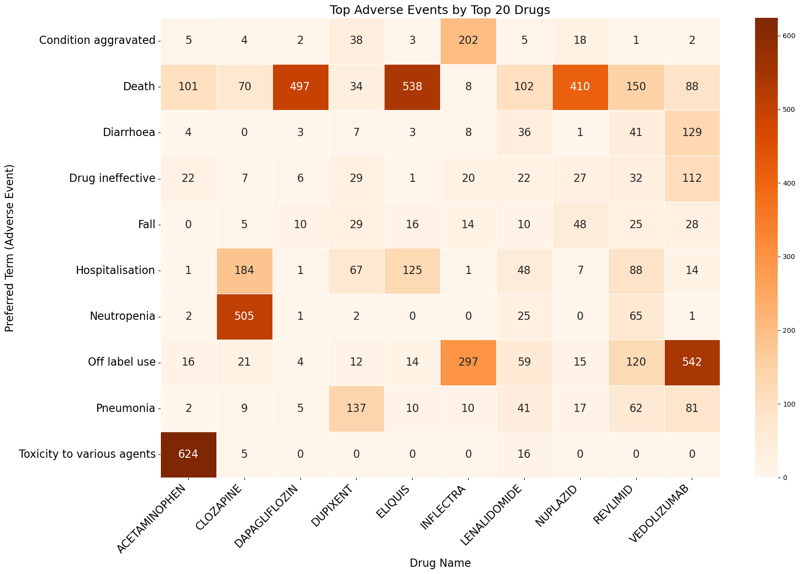
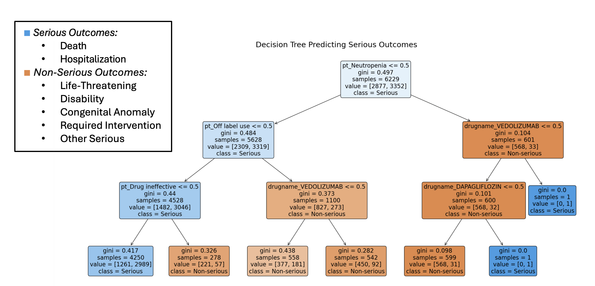

# FDA Adverse Reactions Analysis Info
---
## Contact Information

**Chloe Schnydman**  
[chloeschnydman@comcast.net](mailto:chloeschnydman@comcast.net)  
[LinkedIn](https://www.linkedin.com/in/chloe-schnydman/)

**Rahma Semma**  
[rahmasemma01@gmail.com](mailto:rahmasemma01@gmail.com)  
[LinkedIn](https://www.linkedin.com/in/rahmasemma/)

## Background of Dataset

The FDA’s FAERS (FDA Adverse Event Reporting System) database collects voluntary reports of adverse drug reactions from healthcare providers, patients, and manufacturers. It serves as a critical resource for detecting new safety concerns, understanding drug risks, and making regulatory decisions. Data files include information on demographics, drugs involved, reported reactions, outcomes, and drug usage patterns.

## Dataset

**Source:** [FDA Adverse Event Reporting System (FAERS) Quarterly Data Extract Files](https://fis.fda.gov/extensions/FPD-QDE-FAERS/FPD-QDE-FAERS.html#FOIA)  

**Period Used:** Q4 2024 (October – December 2024) 

**Files:**
- **Demo:** Patient demographic and administrative information, and the initial report image ID number 
- **Drug:** Drug/biologic information from the case reports 
- **Reac:** Reaction information from the reports
- **Outc:** Patient outcome information from the reports
- **Rpsr:** Information on the source of the reports
- **Ther:** Drug therapy start dates and end dates from the reports

**Focus:** `Drug`, `Reac`, `Outc`

### Drug Dataset (20 variables; 13 used)
- `primaryid`: Unique number for identifying a FAERS report (primary link file between data files)
- `caseid`: Number for identifying a FAERS case
- `drug_seq`: Unique number for identifying a drug for a Case
- `role_cod`: Code for drug’s reported role in event (See table below) \
&nbsp; &nbsp; &nbsp; &nbsp; **code** &nbsp; &nbsp; **meaning** \
&nbsp; &nbsp; &nbsp; &nbsp; ---- &nbsp; &nbsp; &nbsp; -------- &nbsp; 
\
&nbsp; &nbsp; &nbsp; &nbsp; PS &nbsp; &nbsp; &nbsp; &nbsp; Primary Suspect Drug \
&nbsp; &nbsp; &nbsp; &nbsp; SS &nbsp; &nbsp; &nbsp; &nbsp; Secondary Suspect Drug \
&nbsp; &nbsp; &nbsp; &nbsp; C &nbsp; &nbsp; &nbsp; &nbsp; &nbsp; Concomitant \
&nbsp; &nbsp; &nbsp; &nbsp; I &nbsp; &nbsp; &nbsp; &nbsp; &nbsp; &nbsp; Interacting \
&nbsp; &nbsp; &nbsp; &nbsp; DN &ensp;&ensp; &ensp; Drug Not Administered 
- `drugname`: Name of medicinal product
- `prod_ai`: Product Active Ingredient 
- `route`: Route of administration
- `dose_vbm`: Verbatim text for dose, frequency, and route, exactly as
entered on report
- `dechal`: Dechallenge code, indicating if reaction abated when drug
therapy was stopped (See table below) \
&nbsp; &nbsp; &nbsp; &nbsp; **code** &nbsp; &nbsp; **meaning** \
&nbsp; &nbsp; &nbsp; &nbsp; ---- &nbsp; &nbsp; &nbsp; -------- &nbsp; 
\
&nbsp; &nbsp; &nbsp; &nbsp; Y &ensp;&ensp;&ensp;&ensp; &ensp; Positive dechallenge \
&nbsp; &nbsp; &nbsp; &nbsp; N &ensp;&ensp;&ensp;&ensp; &ensp; Negative dechallenge \
&nbsp; &nbsp; &nbsp; &nbsp; U &ensp;&ensp;&ensp;&ensp; &ensp; Unknown \
&nbsp; &nbsp; &nbsp; &nbsp; D &ensp;&ensp;&ensp;&ensp; &ensp; Does not apply 
- `dose_amt`: Amount of drug reported
- `dose_unit`: Unit of drug dose 
- `dose_form`: Form of dose reported
- `dose_freq`: Frequency code (See table below)
therapy was stopped (See table below) \
&nbsp; &nbsp; &nbsp; &nbsp; **code** &nbsp; &nbsp; **meaning** \
&nbsp; &nbsp; &nbsp; &nbsp; ---- &nbsp; &nbsp; &nbsp; -------- &nbsp; 
\
&nbsp; &nbsp; &nbsp; &nbsp; 1X &ensp;&ensp;&ensp; &ensp; Once or one time \
&nbsp; &nbsp; &nbsp; &nbsp; BID &ensp;&ensp;&ensp;&ensp; Twice a day \
&nbsp; &nbsp; &nbsp; &nbsp; BIW &ensp;&ensp; &ensp; Twice a week \
&nbsp; &nbsp; &nbsp; &nbsp; HS &ensp;&ensp;&ensp;&ensp;&ensp; At bedtime \
&nbsp; &nbsp; &nbsp; &nbsp; PRN &ensp;&ensp;&ensp;&ensp; As needed \
&nbsp; &nbsp; &nbsp; &nbsp; Q12H &ensp;&ensp;&ensp; Every 12 hours \
&nbsp; &nbsp; &nbsp; &nbsp; Q2H &ensp;&ensp;&ensp;&ensp; Every 2 hours \
&nbsp; &nbsp; &nbsp; &nbsp; Q3H &ensp;&ensp;&ensp;&ensp; Every 3 hours \
&nbsp; &nbsp; &nbsp; &nbsp; Q3W &ensp;&ensp; &ensp; Every 3 weeks \
&nbsp; &nbsp; &nbsp; &nbsp; Q4H &ensp;&ensp;&ensp;&ensp; Every 4 hours \
&nbsp; &nbsp; &nbsp; &nbsp; Q5H &ensp;&ensp;&ensp;&ensp; Every 5 hours \
&nbsp; &nbsp; &nbsp; &nbsp; Q6H &ensp;&ensp;&ensp;&ensp; Every 6 hours \
&nbsp; &nbsp; &nbsp; &nbsp; Q8H &ensp;&ensp;&ensp;&ensp; Every 8 hours \
&nbsp; &nbsp; &nbsp; &nbsp; QD &ensp;&ensp;&ensp;&ensp; &ensp; Daily \
&nbsp; &nbsp; &nbsp; &nbsp; QH &ensp;&ensp;&ensp;&ensp; &ensp; Every hour \
&nbsp; &nbsp; &nbsp; &nbsp; QID &ensp;&ensp;&ensp;&ensp;&ensp; 4 times a day \
&nbsp; &nbsp; &nbsp; &nbsp; QM &ensp;&ensp;&ensp;&ensp;&ensp; Monthly \
&nbsp; &nbsp; &nbsp; &nbsp; QOD &ensp;&ensp;&ensp;&ensp; Every other day \
&nbsp; &nbsp; &nbsp; &nbsp; QOW &ensp;&ensp; &ensp; Every other week \
&nbsp; &nbsp; &nbsp; &nbsp; QW &ensp;&ensp;&ensp;&ensp;&ensp; Every week \
&nbsp; &nbsp; &nbsp; &nbsp; TID &ensp;&ensp;&ensp;&ensp; &ensp; 3 times a day \
&nbsp; &nbsp; &nbsp; &nbsp; TIW &ensp;&ensp;&ensp;&ensp;&ensp; 3 times a week \
&nbsp; &nbsp; &nbsp; &nbsp; UNK &ensp;&ensp;&ensp; &ensp; Unknown

### Reac Dataset (4 variables; 3 used)
- `primaryid`
- `caseid`
- `pt`: “Preferred Term”-level medical terminology describing the event, using the Medical Dictionary for Regulatory Activities (MedDRA)

### Outc Dataset (3 variables; all used)
- `primaryid`
- `caseid`
- `outc_cod`: code for a patient outcome (See table below) \
&nbsp; &nbsp; &nbsp; &nbsp; **code** &nbsp; &nbsp; **meaning** \
&nbsp; &nbsp; &nbsp; &nbsp; ---- &nbsp; &nbsp; &nbsp; -------- &nbsp; 
\
&nbsp; &nbsp; &nbsp; &nbsp; DE &ensp;&ensp;&ensp;&ensp; Death \
&nbsp; &nbsp; &nbsp; &nbsp; LT &ensp;&ensp;&ensp; &ensp; Life-Threatening \
&nbsp; &nbsp; &nbsp; &nbsp; HO &ensp;&ensp; &ensp; Hospitalization \
&nbsp; &nbsp; &nbsp; &nbsp; DS &nbsp; &nbsp; &nbsp; &nbsp; Disability \
&nbsp; &nbsp; &nbsp; &nbsp; CA &ensp;&ensp;&ensp;&ensp; Congenital Anomaly \
&nbsp; &nbsp; &nbsp; &nbsp; RI &ensp;&ensp;&ensp;&ensp;&ensp; Required Intervention to Prevent Permanent
Impairment/Damage \
&nbsp; &nbsp; &nbsp; &nbsp; OT &ensp;&ensp;&ensp;&ensp; Other Serious

## Purpose of Project

The purpose of this project is to analyze adverse drug reactions reported in the FDA's FAERS (FDA Adverse Event Reporting System) database. This analysis aims to:
- Identify patterns and trends in adverse reactions related to various drugs
- Determine which drugs are associated with severe or common adverse reactions
- Examine demographic factors that may influence the likelihood or severity of reported reactions
- Provide insights for healthcare professionals and regulatory agencies to improve drug safety and post-market surveillance

## Introduction

The FDA’s FAERS database collects voluntary reports of adverse drug reactions from healthcare providers, patients, and manufacturers. It serves as a critical resource for detecting new safety concerns, understanding drug risks, and making regulatory decisions.

## Materials and Methods

We analyzed FAERS data by merging adverse outcomes with reported drug and preferred term (PT) codes. To reduce confounding and ensure clearer attribution of adverse events, we focused on patients who were reported to have taken only one drug at a time. Using `Python` (`pandas`, `seaborn`, `sci-kit-learn`), we visualized the top 10 drugs and adverse events via a heatmap and trained a logistic regression model to evaluate predictors of serious outcomes. We also built a decision tree classifier (max depth = 3) to illustrate how specific PTs and drugs contribute to the classification of serious versus non-serious reports. All data were preprocessed with one-hot encoding, and models were evaluated on interpretability and visual clarity for presentation.

## Results

### Figures

  
Figure 1: Top 20 Most Reported Drugs

  
Figure 2: Top 15 Most Reported Reactions  

   
Figure 3: Top Drugs Associated with Death Outcomes

  
Figure 4: Top Adverse Events by Top 10 Drugs

  
Figure 5: Dosages by Death Outcome per Top 20 Drugs

  
Figure 6: Decision Tree Predicting Serious Outcomes

  
&nbsp; &nbsp; 
  
  Figures 7 & 8: Drug Effects on Death Odds Logistic Regression and its Coefficients

 

## Drug Names and Descriptions

- **Acetaminophen:** Pain/fever treatment  
- **Carboplatin:** Cancer treatment used to treat cancer of the ovaries, head, and neck
- **Carbidopa/Levodopa:** Parkinson’s disease treatment  
- **Clozapine:** Antipsychotic for treatment-resistant schizophrenia  
- **Dapagliflozin:** Treatment for type 2 diabetes, heart failure, and chronic kidney disease  
- **Dupixent:** Treatment for atopic dermatitis, asthma and other inflammatory conditions
- **Eliquis:** Blood thinner used to treat and prevent blood clots
- **Humira:** Treatment used for various autoimmune conditions, like Crohn’s disease, ulcerative colitis, rheumatoid arthritis, psoriatic arthritis, ankylosing spondylitis, and psoriasis  
- **Human Immunoglobulin G:** Treatment for immunodeficiency and various autoimmune disorders  
- **Inflectra:** Treatment for various autoimmune conditions, like Crohn’s disease, ulcerative colitis, rheumatoid arthritis, psoriatic arthritis, ankylosing spondylitis, and psoriasis
- **Keytruda:** Immunotherapy cancer treatment  
- **Lenalidomide:** Treatment for myelodysplastic syndrome (MDS), multiple myeloma, and mantle cell lymphoma (MCL) 
- **Methotrexate:** Treatment for treat rheumatoid arthritis by decreasing the activity of your immune system, treats psoriasis by slowing the growth of skin cells, and treats cancer by slowing the growth of cancer cells
- **Mounjaro:** Treatment to improve blood sugar (glucose) in adults with type 2 diabetes mellitus  
- **Mycophenolate Mofetil:** Immunosuppressant used to prevent transplant organ rejection
- **Nuplazid:** Antipsychotic for Parkinson’s disease psychosis  
- **Prednisone:** Cortisone-like treatment or steroid used to treat asthma, allergic reactions, arthritis, inflammatory bowel disease, and adrenal and blood or bone marrow disorders
- **Revlimid:** Blood cancer treatment  
- **Rinvoq:** Treatment for various inflammatory conditions, like rheumatoid arthritis, psoriatic arthritis, atopic dermatitis, ulcerative colitis, and Crohn’s disease
- **Rituximab:** Non-Hodgkin’s lymphoma treatment
- **Skyrizi:** Plaque psoriasis treatment
- **Tecentriq:** Treatment for urothelial carcinoma, non-small cell lung cancer (NSCLC), small cell lung cancer (SCLC), hepatocellular carcinoma (HCC), and melanoma
- **Vedolizumab (Entyvio):** Treatment for ulcerative colitis (UC) and Crohn’s disease (CD)
- **Venclexta:** Treatment for adult patients with chronic lymphocytic leukemia (CLL) or small lymphocytic lymphoma (SLL)

## Conclusion

In our bar plots (Figures 1, 2, and 3), we observed that a handful of drugs, such as **Eliquis** and **Humira**, were responsible for a disproportionate number of adverse event reports, suggesting their widespread use and potential safety concerns. Among reported reactions, “Death,” “Off label use,” and “Drug ineffective” stood out not only in frequency but also in severity, emphasizing the importance of monitoring treatment effectiveness and proper usage. 
By comparing drugs with death-specific reports, we identified medications like **Nuplazid** and **Dapagliflozin** that may warrant closer post-market evaluation. Our heatmap analysis (Figure 4) further revealed consistent overlaps between top drugs and severe adverse events like “Hospitalization” and “Neutropenia,” suggesting shared high-risk patterns across multiple therapies. 
The box plot (Figure 5) does well on identifying non-death cases (Class 0), but it struggles with precision on death cases (Class 1), which means that when the model is predicts death, it's often wrong. However, death is a strong (0.70), which means it captures 70% of real deaths. This trade-off is expected in imbalanced data.

Using a decision tree classifier (Figure 6), we demonstrated that a few adverse event terms could meaningfully separate serious from non-serious cases, offering a transparent tool for early signal detection.

The Logistic Regression Model and its Coefficients (Figure 7 & 8) show how much each drug affects the odds of death, with  positive coefficinets representing an increase in the odds of death and negative coeficients representing an decrease in the odds of death. **Eliquis**, **Nuplazid** and **Dapagliflozin** were most strongly associated with death while **Inflectra**, **Vedolizumab** and **Dupixent** where found more often in non-death cases. 

\
**DISCLAIMER**: These are associations, not causation. It's possible that Deaths are more commonly reported with certain drugs due to the conditions they treat (e.g., cancer vs. allergy) and some drugs appear “safer” because they’re used in healthier populations

## Literature Cited

U.S. Food and Drug Administration. (2025, January 28). *FDA Adverse Event Reporting System (FAERS) Quarterly Data Extract Files*.  
[https://fis.fda.gov/extensions/FPD-QDE-FAERS/FPD-QDE-FAERS.html#FOIA](https://fis.fda.gov/extensions/FPD-QDE-FAERS/FPD-QDE-FAERS.html#FOIA)

